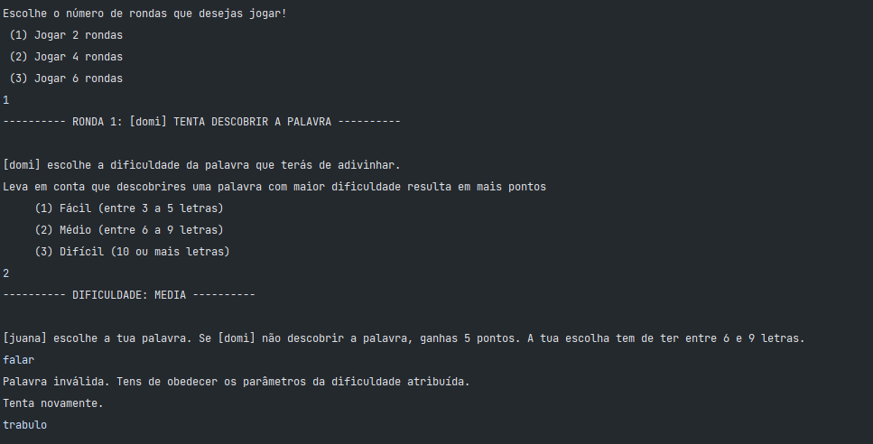

# Hangman
Hangman is a game made in Java where two players can challenge each other's capacity of guessing the correct word. User interaction is achieved by only using the console. The player with most pints wins the game!

## How to play
- In PlayervsPlayer mode, the first player gets to choose how many rounds the game will have.
- Then the same player chooses the word's difficulty and the second player has to create a word obeying that difficulty.
- The game begins! If the first player guesses the word correctly, gains points according to the difficulty, otherwise the opponent wins 5 points.
- Turns hange. After all the rounds, the game finishes and the stats are displayed.

  
  
  
  

## Rules
- One player plays at a time.
- No looking into the computer when it is your opponent's turn!! No one likes cheaters.
- Just one charecter from the keyboard allowed
- Symbols or numbers are not accepted, only letters.

  
  

## Point System
- Not guessing the word: opponent wins 5 points
- Guessing EASY word: player wins 5 points
- Guessing MEDIUM word: player wins 10 points
- Guessing HARD word: player wins 15 points

## To be developed
- PlayervsComputer mode: computer only chooses the word and player has to discover. Rules and systems to be established
- Prevention of unknown words of the portuguese or english dictionary.
- Prevention of swear words.
- Game interface to substitute the console
